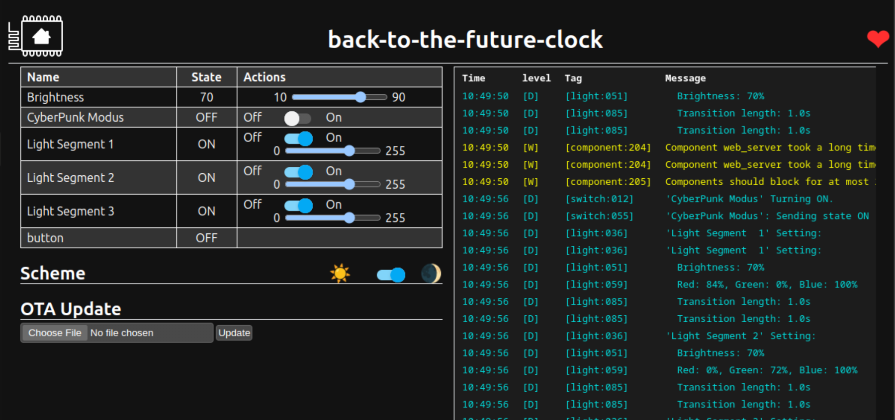
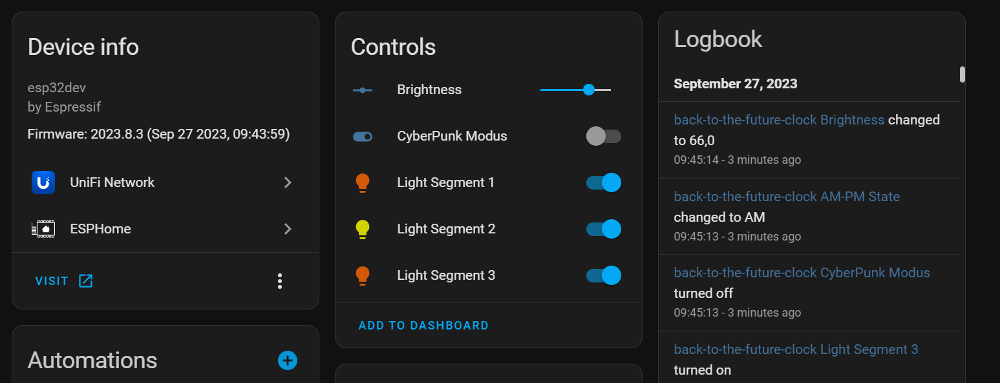

# Back to the Future Clock

This is a port of jejelinge's code to Esphome for the Back to the Future Clock.  
See https://www.thingiverse.com/thing:6144608  

The Code is using an ESP32 Microcontroller, but you can also use an ESP8266.  

Pins used:  

- GPIO13 - DATA Pin for RGB LED's
- GPIO14 - Clock for TM1637 Displays
- GPIO25 - DATA Pin for Date display
- GPIO26 - DATA Pin for Time display
- GPIO26 - DATA Pin for Year display
- GPIO32 - AM LED
- GPIO33 - PM LED

Optional:   
- GPIO21 - Button for switching between Back to the Future / CyberPunk or OFF

Adapt these to your config or likings.  

Connect the TM1637 Displays to 3.3V and the RGB LED's to 5V.  

In my setup, AM/PM LED's are using a shared GND, with a resistor of 47 Ohm.  

It also features a WebServer where you can control certain elements (Brightness and CyberPunk Mode), and can be integrated into Home Assistant.  

Many thanks to jejelinge for providing the original code and STL files for 3D Printing!